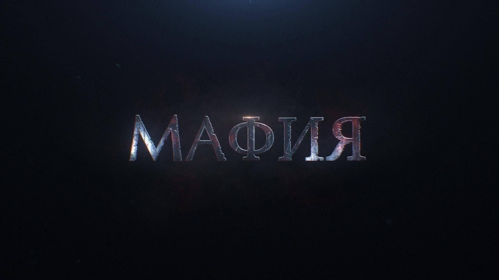

<div align="center">


# Мафия — онлайн

Бесплатная многопользовательская игра «Мафия» с регистрацией, комнатами, чатом, рейтингом, AI-агентами и WebSocket в реальном времени.

**Стек:** Node.js + Express + Socket.IO + SQLite (сервер), React + Vite (клиент). Продакшен: PM2 + Caddy (HTTPS).

---

## Возможности

### Игра
- Комнаты на 3–10 игроков, регистрация в партию, фазы дня и ночи
- Роли: мафия (дон выбирает ночную жертву), комиссар (Катани), доктор, маньяк, адвокат и др. — состав зависит от числа игроков
- После ночи — сводка в чате, сразу дневное голосование (90 сек): сначала выдвижение, затем «да/нет»; больше половины «нет» — оправдание
- Казнь, если строго больше половины живых нажали «да»
- Чат в комнате (общий, мафия ночью, выбывшие, наблюдатели)
- Комнаты с меткой **AI**: виртуальные игроки (DeepSeek) пишут в чат, голосуют и ходят ночью
- MMR и статистика после партий, репутация игроков

### Сайт
- **Комнаты** — игровые и чат-комнаты (в чат-комнатах работает викторина)
- **Новости** — объявления администрации, голосования, комментарии с ответами, бейдж непрочитанного
- **Кабинет** — профиль, личные сообщения, поддержка, поиск игроков, тема оформления
- **Информация** — правила, роли, игры с AI-агентами, FAQ, рейтинг, топ викторины, команда проекта
- **Вход** — логин/пароль, Telegram OIDC, VK ID
- **Админ-панель** — пользователи, комнаты (в т.ч. AI), новости, модерация, DeepSeek, настройки сайта

---

## Требования

- Node.js **20+** (18 тоже подойдёт)
- npm
- Git

На Linux для `better-sqlite3` могут понадобиться: `build-essential`, `python3`.

---

## Быстрые команды

| Задача | Команда |
|--------|---------|
| Dev: сервер | `cd server && npm install && npm run dev` |
| Dev: клиент | `cd client && npm install && npm run dev` |
| Сборка клиента | `cd client && npm run build` |
| Сборка сервера | `cd server && npm run build` |
| Запуск prod локально | `cd server && npm start` (после сборки обоих) |
| Обновление на VPS | `bash scripts/deploy.sh` или [раздел ниже](#обновление-на-сервере) |

---

## Локальная разработка

### 1. Клонировать и установить зависимости

```bash
git clone https://github.com/dabroivanov-ship-it/mafia-game.git
cd mafia-game

cd server && npm install
cd ../client && npm install
```

### 2. Запуск (два терминала)

**Сервер** — TypeScript через `tsx`, перезапуск при изменениях:

```bash
cd server
npm run dev
```

→ API и WebSocket: http://localhost:3001

**Клиент** — Vite с hot reload:

```bash
cd client
npm run dev
```

→ Интерфейс: http://localhost:5173

Клиент в dev-режиме проксирует `/socket.io` и `/api` на порт 3001 (см. `client/vite.config.ts`).

### 3. Локальный запуск «как на проде»

```bash
cd client && npm run build
cd ../server && npm run build && npm start
```

Откройте http://localhost:3001 — сервер отдаёт и API, и собранный React из `client/dist`.

### 4. Первый вход

1. Откройте http://localhost:5173 (dev) или http://localhost:3001 (prod-режим)
2. Зарегистрируйтесь (или войдите через Telegram / VK)
3. Зайдите в комнату → **«Запустить игру»** → другие игроки нажимают **«Вступить в игру»**
4. Минимум **3 игрока** (удобно проверить в нескольких вкладках; в комнате с AI свободные места занимают боты)

**Данные:**
- База SQLite: `server/data/mafia.db` (создаётся автоматически)
- Аватары: `server/uploads/avatars/`
- Изображения новостей: `server/uploads/news/`

Схема БД и новые таблицы (голосования, прочитанные новости и т.д.) применяются **автоматически** при старте сервера — отдельная миграция не нужна.

---

## Установка на VPS (продакшен)

Пример: Ubuntu VPS, домен **realmafia.online**, каталог **`/home/mafia-game`**.

### DNS

| Тип | Имя | Значение |
|-----|-----|----------|
| A | `@` | IP VPS |
| A | `www` | IP VPS |

### ПО на сервере

```bash
apt update && apt upgrade -y
apt install -y git build-essential python3

# Node.js 20
curl -fsSL https://deb.nodesource.com/setup_20.x | bash -
apt install -y nodejs

# Caddy (HTTPS)
apt install -y debian-keyring debian-archive-keyring apt-transport-https curl
curl -1sLf 'https://dl.cloudsmith.io/public/caddy/stable/gpg.key' | gpg --dearmor -o /usr/share/keyrings/caddy-stable-archive-keyring.gpg
curl -1sLf 'https://dl.cloudsmith.io/public/caddy/stable/debian.deb.txt' | tee /etc/apt/sources.list.d/caddy-stable.list
apt update && apt install -y caddy

npm install -g pm2
```

### Клонирование и сборка

```bash
cd /home
git clone https://github.com/dabroivanov-ship-it/mafia-game.git
cd mafia-game

cd client && npm install && npm run build
cd ../server && npm install && npm run build
```

Проверка:

```bash
test -f client/dist/index.html && echo "client OK"
test -f server/dist/server.js && echo "server OK"
```

### Переменные окружения

```bash
cp server/.env.example server/.env
nano server/.env
```

Обязательно на проде:

| Переменная | Описание |
|------------|----------|
| `JWT_SECRET` | Случайная строка **минимум 32 символа** (`openssl rand -hex 32`) |
| `CORS_ORIGIN` | Публичный URL сайта без слэша в конце, напр. `https://realmafia.online` |

Остальное — см. [переменные окружения](#переменные-окружения).

PM2 читает `server/.env` через `ecosystem.config.cjs`.

### Запуск

```bash
cd /home/mafia-game
pm2 start ecosystem.config.cjs
pm2 save
pm2 startup   # выполните команду, которую выведет pm2
```

Проверка:

```bash
pm2 status
curl http://127.0.0.1:3001/api/health
```

### Caddy

```bash
cp Caddyfile /etc/caddy/Caddyfile
# замените домен в Caddyfile на свой
caddy validate --config /etc/caddy/Caddyfile
systemctl reload caddy
systemctl enable caddy
```

### Firewall

```bash
ufw allow OpenSSH
ufw allow 80
ufw allow 443
ufw enable
```

Порт **3001** наружу не открывайте — к нему ходит только Caddy локально.

---

## Обновление на сервере

**Рекомендуемый способ** — скрипт деплоя (sync git, сборка, проверка БД, restart PM2):

```bash
cd /home/mafia-game
bash scripts/deploy.sh
```

Скрипт сбрасывает локальные правки **отслеживаемых** файлов (например старый `Caddyfile` на сервере) до версии из репозитория. Файлы вне git (`server/.env`, `data/`, `uploads/`) не затрагиваются.

Если `git pull` падает с «would be overwritten by merge», выполните один раз:

```bash
cd /home/mafia-game
git fetch origin
git reset --hard origin/main
bash scripts/deploy.sh
```

Домен для Caddy задаётся в `Caddyfile` в репозитории; после деплоя при необходимости:

```bash
cp Caddyfile /etc/caddy/Caddyfile
caddy validate --config /etc/caddy/Caddyfile
systemctl reload caddy
```

**Вручную:**

```bash
cd /home/mafia-game && git pull && \
cd client && npm install && npm run build && \
cd ../server && npm install && npm run build && \
cd .. && pm2 restart mafia-server
```

В браузере — жёсткое обновление (Ctrl+F5), чтобы подтянуть новый клиент.

Файл **`server/data/mafia.db`** не удаляйте.

---

## Схема работы

```
Браузер
   ↓ HTTPS :443
 Caddy
   ↓ reverse_proxy 127.0.0.1:3001
 Node.js (server/dist/server.js)
   ├─ /api/auth/*        → регистрация, вход, Telegram OIDC, VK ID
   ├─ /api/profile/*     → профиль, рейтинг, поиск
   ├─ /api/news/*        → новости, комментарии, голосования
   ├─ /api/messages/*    → личные сообщения
   ├─ /api/admin/*       → админ-панель
   ├─ /api/health        → статус
   ├─ /socket.io/*       → игра и чат (WebSocket)
   ├─ /uploads/*         → аватары, новости, брендинг
   └─ /*                 → React (client/dist)
```

---

## Переменные окружения

Файл-образец: `server/.env.example`. На VPS копируйте в `server/.env`.

| Переменная | Обязательно | Описание |
|------------|-------------|----------|
| `JWT_SECRET` | да (prod) | Секрет JWT, мин. 32 символа |
| `CORS_ORIGIN` | да (prod) | URL сайта, напр. `https://example.ru` |
| `PORT` | нет | Порт сервера (по умолчанию 3001) |
| `JWT_EXPIRES` | нет | Срок токена (по умолчанию 7d) |
| `ADMIN_USERNAMES` | нет | Логины админов через запятую |
| `DB_PATH` | нет | Путь к SQLite (по умолчанию `server/data/mafia.db`) |
| `UPLOADS_DIR` | нет | Папка аватаров |
| `TELEGRAM_BOT_TOKEN` | нет | Telegram-бот |
| `TELEGRAM_WEBAPP_URL` | нет | URL Web App |
| `TELEGRAM_OIDC_CLIENT_ID` | нет | Вход через Telegram OIDC |
| `TELEGRAM_OIDC_CLIENT_SECRET` | нет | Секрет OIDC |
| `VK_CLIENT_ID` | нет | Вход через VK ID |
| `VK_CLIENT_SECRET` | нет | Секрет VK ID |
| `VK_REDIRECT_URI` | нет | Callback VK (по умолчанию `{CORS_ORIGIN}/api/auth/vk/callback`) |
| `DEEPSEEK_API_KEY` | нет | Ключ DeepSeek для AI-игроков (можно задать в админке) |
| `DEEPSEEK_BASE_URL` | нет | Базовый URL API DeepSeek (опционально, прокси) |
| `ALLOW_INSECURE_DEV` | нет | Только локально: ослабить проверки JWT/CORS |

---

## API (основное)

| Метод | URL | Описание |
|-------|-----|----------|
| POST | `/api/auth/register` | Регистрация |
| POST | `/api/auth/login` | Вход |
| GET | `/api/auth/me` | Текущий пользователь (Bearer token) |
| GET | `/api/profile/leaderboard` | Рейтинг игроков (`limit`, `offset`) |
| GET | `/api/news` | Опубликованные новости |
| POST | `/api/news/:id/poll/vote` | Голос в опросе новости |
| GET | `/api/messages/unread-count` | Непрочитанные личные сообщения |
| GET | `/api/health` | Статус сервера |

WebSocket: `/socket.io` — комнаты, игра, чат, викторина.


---

## Структура проекта

```
mafia-game/
├── client/
│   ├── src/
│   │   ├── components/    # React-компоненты
│   │   ├── content/       # Тексты правил, FAQ, ролей
│   │   ├── App.tsx
│   │   └── api.ts
│   └── dist/              # Сборка Vite (не в git)
├── server/
│   ├── server.ts          # Express + Socket.IO
│   ├── dist/              # Сборка tsc (не в git)
│   ├── auth/              # JWT, SQLite, Telegram OIDC, VK ID
│   ├── game/              # Движок мафии, роли, AI-агенты (DeepSeek)
│   ├── news/              # Новости, комментарии, голосования
│   ├── admin/             # API админ-панели
│   ├── profile/           # Профиль, рейтинг, staff
│   ├── messages/          # Личные сообщения
│   ├── moderation/        # Модерация, лог нарушений
│   ├── quiz/              # Викторина в чат-комнатах
│   ├── data/mafia.db      # БД (создаётся автоматически)
│   └── .env.example
├── scripts/
│   ├── deploy.sh          # Деплой на VPS
│   └── verify-db.mjs      # Проверка схемы SQLite
├── Caddyfile
├── ecosystem.config.cjs   # PM2
└── README.md
```

---

## Лицензия и репозиторий

GitHub: https://github.com/dabroivanov-ship-it/mafia-game
